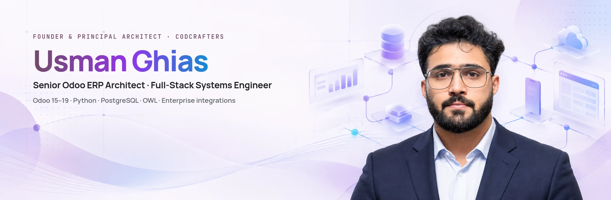
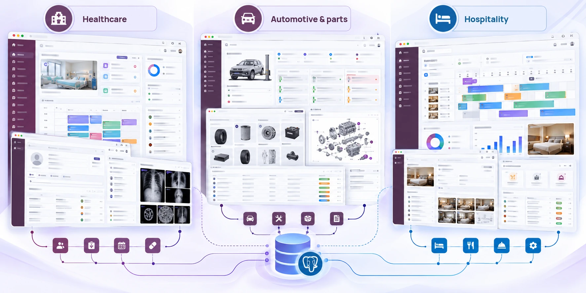

<!-- Profile README for Usman Ghias · https://usmanghias.co.uk · previous version: README.backup.md -->

<a href="https://usmanghias.co.uk">
  <picture>
    <source media="(prefers-color-scheme: dark)" srcset="assets/brand/profile-hero-dark.webp">
    
  </picture>
</a>

# Usman Ghias

**Senior Odoo ERP Architect & Full-Stack Systems Engineer** 
Founder & Principal Architect at [CODCrafters](https://codcrafters.org) · Remote worldwide

I design and deliver production-grade ERP systems, integrations, business platforms and digital products. My work spans Odoo 15–19, Python, PostgreSQL, OWL, reporting, APIs, full-stack web systems and mobile applications.

<picture>
  <source media="(prefers-color-scheme: dark)" srcset="assets/brand/proof-strip-dark.svg">
  
</picture>

Totals include work delivered through direct contracts, organisations and freelance platforms. Client details and source code are shown only where confidentiality permits.

## What I architect

- **Odoo ERP architecture**: Odoo 15–19, Python ORM, PostgreSQL, OWL, QWeb, Odoo.sh, migrations, reporting, BI and performance engineering.
- **Product engineering**: Next.js, React, TypeScript, FastAPI, Flutter, offline-first applications and production APIs.
- **Integrations & data**: commerce, logistics, payments, document processing, reporting, automation and external platforms.

## Selected Odoo systems

Representative architecture across operational domains where ERP reliability, data integrity and maintainability matter.

Representative composition of selected Odoo solution domains, not screenshots of client systems.

#### Healthcare operations
**Challenge:** clinical, billing, pharmacy and reporting workflows running in disconnected tools. 
**Architecture:** a modular Odoo system of 50+ custom modules covering patients, appointments, lab, pharmacy, insurance, billing and management reporting. 
**Outcome:** one system of record for operational and administrative teams. [Healthcare work →](https://www.codcrafters.org/industries/healthcare)

#### Automotive and parts operations
**Challenge:** workshop jobs, parts catalogues, pricing, invoicing and B2B distribution handled across separate processes. 
**Architecture:** Odoo 17/18 Enterprise, PostgreSQL and OWL, with 15+ custom modules for dynamic pricing, parts catalogues, a B2B portal, real-time carrier APIs and EU VAT rules. 
**Outcome:** reworked ORM and SQL queries cut report load times by about 60% for a European parts distributor. [Automotive work →](https://www.codcrafters.org/industries/automotive)

#### Hospitality operations
**Challenge:** reservations, housekeeping, POS and billing split across departments. 
**Architecture:** a unified Odoo operational database with role-based workflows for front office, housekeeping, restaurant and accounts. 
**Outcome:** departments working from the same reservations, charges and guest records. [Hospitality work →](https://www.codcrafters.org/industries/hotel-restaurants)

## Product engineering

Conceptual product visual. Dashboard figures shown inside the interface are illustrative demo data.

#### [CLIVORA](https://clivora.io): freelancer and agency workspace
Freelancers and small agencies run clients, projects and invoicing across too many disconnected tools. CLIVORA puts CRM, projects, tasks, timesheets, files and branded invoicing in one account on the web and Android, with offline-first local storage on mobile and sync between both surfaces. 
**My role:** founder; product design, architecture and delivery through CODCrafters. 
**Status:** live at [clivora.io](https://clivora.io) and on [Google Play](https://play.google.com/store/apps/details?id=org.codcrafters.clivora). 
`Flutter` `Riverpod` `Hive + SQLite` `Next.js` `REST APIs`

#### Odoo financial reporting & BI
Native Odoo Spreadsheets for multi-dimensional financial and operational reporting, extended with custom Python and OWL data retrieval, plus executive KPI dashboards the leadership team uses for day-to-day monitoring. Legacy reports were migrated into maintainable, native Odoo reporting. 
`Odoo Spreadsheets` `Python` `OWL` `PostgreSQL`

## Experience snapshot

- **Founder & Principal Architect**, CODCrafters (2022 – present)
- **Senior Odoo Spreadsheets & BI Specialist**, Plectar, Switzerland (2025 – present)
- Selected ERP and product engagements across Europe, the Middle East and North America

MS Software Engineering (in progress), Quantic School of Business & Technology · BS Software Engineering, PUCIT.
Full history: [résumé](https://usmanghias.co.uk/resume.pdf) · [portfolio](https://usmanghias.co.uk)

## Open-source engineering

**Merged**

- [zifter/clickhouse-migrations #105](https://github.com/zifter/clickhouse-migrations/pull/105): moved the PyPI release workflow to Trusted Publishing, so releases no longer depend on a long-lived API token stored in CI.

**Under maintainer review**

- [progovoy/vmn #173](https://github.com/progovoy/vmn/pull/173): adds a `--base` option to `vmn show` (issue #150).
- [cubrid-lab/sqlalchemy-cubrid #455](https://github.com/cubrid-lab/sqlalchemy-cubrid/pull/455): stops native CUBRID `-493` syntax errors being misreported as `NoSuchTableError` during table reflection (issue #454).
- [ehtishammubarik/websieve #47](https://github.com/ehtishammubarik/websieve/pull/47): preserves indentation inside fenced code blocks when cleaning pages (issue #42).

Community: portfolio listed in [emmabostian/developer-portfolios](https://github.com/emmabostian/developer-portfolios/pull/4039).

## Technical stack

| Area | Tools |
| :--- | :--- |
| **Odoo** | Odoo 15–19 · Python ORM · OWL · QWeb · Odoo.sh |
| **Applications** | Python · TypeScript · Next.js · FastAPI · Flutter |
| **Data** | PostgreSQL · Redis · MongoDB |
| **Delivery** | Docker · Linux · AWS · Nginx · GitHub Actions |

## GitHub activity

<picture>
  <source media="(prefers-color-scheme: dark)" srcset="https://raw.githubusercontent.com/UsmanGhias/UsmanGhias/output/github-stats-dark.svg">
  
</picture>

<picture>
  <source media="(prefers-color-scheme: dark)" srcset="https://raw.githubusercontent.com/UsmanGhias/UsmanGhias/output/github-contribution-grid-snake-dark.svg">
  
</picture>

Generated daily by a GitHub Action in this repository.

## How I work

Understand the operation → Design for change → Build cleanly → Test real workflows → Ship with documentation

## Current focus

- Odoo reporting and financial BI
- Enterprise integrations and automation
- CLIVORA product engineering
- Focused open-source contributions

## Contact

**Building or modernising an Odoo system?**

[Portfolio](https://usmanghias.co.uk) · [Email](mailto:iusmanghias@gmail.com) · [LinkedIn](https://www.linkedin.com/in/iusmanghias) · [CODCrafters](https://codcrafters.org) · [Upwork](https://www.upwork.com/freelancers/usmanghias) 
Prefer chat? [WhatsApp](https://wa.me/923126912440)
