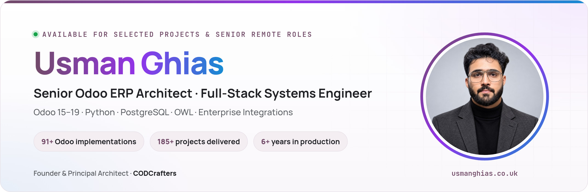

<!-- Profile README for Usman Ghias · https://usmanghias.co.uk -->
<!-- Previous version preserved in README.backup.md -->

<a href="https://usmanghias.co.uk">
  <picture>
    <source media="(prefers-color-scheme: dark)" srcset="assets/brand/profile-banner-dark.jpg">
    
  </picture>
</a>

<h1 align="center">Usman Ghias</h1>

  <b>Senior Odoo ERP Architect &amp; Full-Stack Systems Engineer</b> 
  Founder &amp; Principal Architect at <a href="https://codcrafters.org">CODCrafters</a> · Remote worldwide · UTC+5

  I design and deliver production-grade ERP systems, business platforms, integrations and digital products.
  My work spans Odoo 15–19, Python, PostgreSQL, OWL, Next.js, Flutter, APIs, reporting and operational automation.

  
  
  

 

<picture>
  <source media="(prefers-color-scheme: dark)" srcset="assets/brand/proof-strip-dark.svg">
  
</picture>

Totals include work delivered on and off Upwork. Client names and source code are shared only where confidentiality allows.

## About

I'm a Senior Odoo ERP Architect and full-stack engineer working with international businesses on systems that support real operations: finance, inventory, manufacturing, healthcare, hospitality, automotive, field service, reporting and customer workflows.

I lead architecture and delivery through **CODCrafters** while staying hands-on with Python, PostgreSQL, OWL, APIs, web applications, mobile products and infrastructure. I care about systems that are understandable, maintainable and still useful long after launch.

**Credentials:** Odoo Certified Developer (Odoo 14–19) · MSSE candidate, Quantic School of Business &amp; Technology (USA) · BCompSc, PUCIT · [ORCID 0009-0009-4038-5762](https://orcid.org/0009-0009-4038-5762)

### Selected engagements

| Role | Organisation | Period | Focus |
| :--- | :--- | :--- | :--- |
| Senior Odoo Spreadsheets &amp; BI Specialist | Plectar · Switzerland (remote) | Dec 2025 – present | Native Odoo financial and operational reporting, KPI dashboards |
| Senior Odoo Implementor &amp; Technical PM | Partsnord Europe AB · Sweden (remote) | Oct 2025 – Jul 2026 | Odoo 17/18 Enterprise rollout for an automotive parts distributor |
| Senior Odoo PM &amp; AI Integration Architect | Cavi Consulting · Austria (remote) | Aug 2024 – Feb 2026 | Odoo implementations with AI-assisted document workflows |
| Founder &amp; Principal ERP Architect | CODCrafters · Remote worldwide | Mar 2022 – present | ERP, full-stack and mobile delivery for clients in 25+ countries |

## Core expertise

<table>
  <tr>
    <td width="50%" valign="top">
      <h3>Odoo ERP architecture</h3>
      Odoo 15–19, Community &amp; Enterprise · Python ORM · PostgreSQL · OWL · QWeb &amp; XML · Odoo.sh ·
      migrations &amp; upgrades · performance tuning · Odoo Spreadsheets &amp; BI · JSON-RPC / XML-RPC
    </td>
    <td width="50%" valign="top">
      <h3>Application engineering</h3>
      Python · TypeScript · Next.js &amp; React · Node.js &amp; FastAPI · Flutter &amp; Dart ·
      REST &amp; GraphQL APIs · offline-first mobile · role-based web platforms
    </td>
  </tr>
  <tr>
    <td width="50%" valign="top">
      <h3>Data &amp; infrastructure</h3>
      PostgreSQL · Redis · MongoDB · Docker · Linux · AWS · Nginx · CI/CD ·
      backups &amp; restores · worker, cron and slow-query optimisation
    </td>
    <td width="50%" valign="top">
      <h3>Integrations &amp; automation</h3>
      Payments &amp; commerce (Shopify, WooCommerce) · logistics &amp; carrier APIs · 3PL / WMS connectors ·
      document processing &amp; OCR · AI-assisted workflows · reporting automation
    </td>
  </tr>
</table>

## Featured work

<table>
  <tr>
    <td width="50%" valign="top">
      <h3>Hospital Management ERP</h3>
      <b>Problem</b> · Clinical, billing, pharmacy and lab teams working in disconnected tools. 
      <b>Solution</b> · 50+ custom Odoo modules: patients, appointments, lab, pharmacy, insurance, billing and management dashboards. 
      <b>Result</b> · 50+ workflows automated; administrative overhead down about 40%. 
      <code>Odoo</code> <code>Python</code> <code>PostgreSQL</code> <code>OWL</code> 
      <a href="https://www.codcrafters.org/industries/healthcare">View healthcare work →</a>
    </td>
    <td width="50%" valign="top">
      <h3>Automotive Workshop ERP</h3>
      <b>Problem</b> · Job cards, parts and invoicing handled manually across the workshop floor. 
      <b>Solution</b> · Job cards, parts &amp; inventory, customer approvals, billing and workshop reporting in one Odoo flow. 
      <b>Result</b> · Invoice processing time down about 60%, with near-zero manual entry errors. 
      <code>Odoo</code> <code>Python</code> <code>QWeb</code> <code>XML</code> 
      <a href="https://www.codcrafters.org/industries/automotive">View automotive work →</a>
    </td>
  </tr>
  <tr>
    <td width="50%" valign="top">
      <h3>Hotel &amp; Hospitality ERP</h3>
      <b>Problem</b> · Reservations, housekeeping, restaurant and billing run by separate departments. 
      <b>Solution</b> · Reservations, housekeeping, POS and consolidated guest billing on a single Odoo database. 
      <b>Result</b> · 7 departments unified; zero double bookings. 
      <code>Odoo</code> <code>POS</code> <code>Python</code> <code>PostgreSQL</code> 
      <a href="https://www.codcrafters.org/industries/hotel-restaurants">View hospitality work →</a>
    </td>
    <td width="50%" valign="top">
      <h3>Automotive Parts Distribution</h3>
      <b>Problem</b> · A European distributor outgrowing its catalogue, pricing and B2B ordering setup. 
      <b>Solution</b> · Odoo 17/18 Enterprise rollout with 15+ custom modules: dynamic pricing, parts catalogues, B2B portal, real-time carrier APIs and EU VAT rules. 
      <b>Result</b> · Reworked ORM and SQL queries cut report load times by about 60%. 
      <code>Odoo 17/18</code> <code>PostgreSQL</code> <code>OWL</code> <code>Carrier APIs</code> 
      <a href="https://usmanghias.co.uk">View on portfolio →</a>
    </td>
  </tr>
  <tr>
    <td width="50%" valign="top">
      <h3>Odoo Financial Reporting &amp; BI</h3>
      <b>Problem</b> · Leadership reporting lived in exported spreadsheets that were slow to refresh. 
      <b>Solution</b> · Native Odoo Spreadsheets for multi-dimensional financial and operational analysis, extended with custom Python and OWL data retrieval. 
      <b>Result</b> · Automated KPI dashboards the leadership team uses for day-to-day monitoring. 
      <code>Odoo Spreadsheets</code> <code>Python</code> <code>OWL</code> <code>PostgreSQL</code> 
      <a href="https://usmanghias.co.uk">View on portfolio →</a>
    </td>
    <td width="50%" valign="top">
      <h3>CLIVORA</h3>
      <b>Problem</b> · Freelancers and small agencies juggle clients, projects and invoices across many tools. 
      <b>Solution</b> · A web and Android workspace: client CRM, projects, time tracking, budgets and branded PDF invoicing, with offline storage. 
      <b>Result</b> · Live on the web and Google Play (v2.10.7). Product, architecture and delivery by me. 
      <code>Flutter</code> <code>Riverpod</code> <code>Hive + SQLite</code> <code>Next.js</code> 
      <a href="https://clivora.io">clivora.io →</a> · <a href="https://play.google.com/store/apps/details?id=org.codcrafters.clivora">Google Play →</a>
    </td>
  </tr>
</table>

Also delivered: an AI OCR module for customs declarations (99.4% extraction precision), an offline-first barcode app used by 180 field-service technicians, and Odoo POS extensions for retail and multi-branch stores ([OdooCustomPOS](https://github.com/UsmanGhias/OdooCustomPOS), [POS Receipt 14–17](https://github.com/UsmanGhias/POS_Receipt_Odoo_14_15_16_17)).

**[Browse the complete project archive on usmanghias.co.uk →](https://usmanghias.co.uk)**

## Open-source contributions

**Merged**

| Repository | Contribution | Why it matters | PR |
| :--- | :--- | :--- | :--- |
| [zifter/clickhouse-migrations](https://github.com/zifter/clickhouse-migrations) | Switched the PyPI release workflow to Trusted Publishing | Releases no longer depend on a long-lived API token stored in CI | [#105](https://github.com/zifter/clickhouse-migrations/pull/105) |
| [emmabostian/developer-portfolios](https://github.com/emmabostian/developer-portfolios) | Added my portfolio to the community list | Listing in a widely used developer-portfolio index | [#4039](https://github.com/emmabostian/developer-portfolios/pull/4039) |

**Under maintainer review**

| Repository | Contribution | PR |
| :--- | :--- | :--- |
| [progovoy/vmn](https://github.com/progovoy/vmn) | Adds a `--base` option to `vmn show` (issue #150) | [#173](https://github.com/progovoy/vmn/pull/173) |
| [cubrid-lab/sqlalchemy-cubrid](https://github.com/cubrid-lab/sqlalchemy-cubrid) | Stops native `-493` syntax errors being misreported as `NoSuchTableError` during reflection (issue #454) | [#455](https://github.com/cubrid-lab/sqlalchemy-cubrid/pull/455) |
| [ehtishammubarik/websieve](https://github.com/ehtishammubarik/websieve) | Preserves indentation inside fenced code blocks when cleaning pages (issue #42) | [#47](https://github.com/ehtishammubarik/websieve/pull/47) |

I welcome focused issues and pull requests on my public repositories, especially around Odoo modules, OWL components, QWeb reports, integrations, documentation and tests.

## Technical stack

  <picture>
    <source media="(prefers-color-scheme: dark)" srcset="https://skillicons.dev/icons?i=python,ts,js,postgres,redis,mongodb,react,nextjs,nodejs,fastapi,flutter,dart,docker,linux,aws,nginx,githubactions,git&theme=dark&perline=18">
    
  </picture>

  
  
  
  
  
  
  
  

## GitHub activity

<picture>
  <source media="(prefers-color-scheme: dark)" srcset="https://raw.githubusercontent.com/UsmanGhias/UsmanGhias/output/github-stats-dark.svg">
  
</picture>

<picture>
  <source media="(prefers-color-scheme: dark)" srcset="https://raw.githubusercontent.com/UsmanGhias/UsmanGhias/output/github-contribution-grid-snake-dark.svg">
  
</picture>

Both images are generated daily by a GitHub Action in this repository, not by a third-party image service.

## How I engineer

`Understand the business` → `Design for change` → `Build cleanly` → `Test real flows` → `Ship` → `Support`

| Production first | Quality driven | Maintainable | Transparent |
| :--- | :--- | :--- | :--- |
| Software that runs real operations, not demo-only code | Tests, reviews and written acceptance criteria | Clear code, documentation and sensible architecture | Scope first, weekly demos, replies within 24 hours |

## Current focus &amp; availability

| Focus | What I am building |
| :--- | :--- |
| **Odoo + AI** | Practical AI-assisted ERP workflows: document processing, reporting and approvals |
| **Odoo reporting &amp; BI** | Native Odoo Spreadsheets and dashboards for finance and operations teams |
| **CLIVORA** | Freelancer and agency workspace connecting CRM, projects, invoices and client workflows |
| **Open source** | Focused fixes and features for Python tooling, plus reusable Odoo modules |

Available for selected Odoo, full-stack and mobile projects, and for senior remote roles. I work in UTC+5 and overlap with European, Middle East and US morning hours.

## Contact

**Need an experienced Odoo architect or full-stack technical owner?** Send a short note with your goal, current stack and timeline.

  
  
  
  
  
  

Usman Ghias · <a href="https://usmanghias.co.uk">usmanghias.co.uk</a> · Founder of <a href="https://codcrafters.org">CODCrafters</a>

