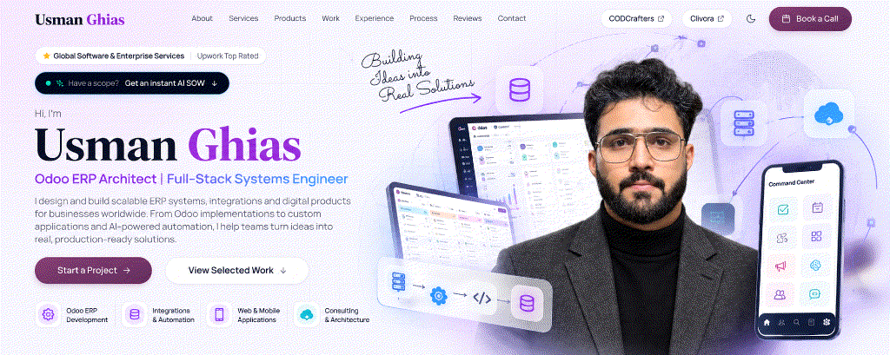
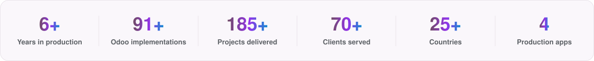
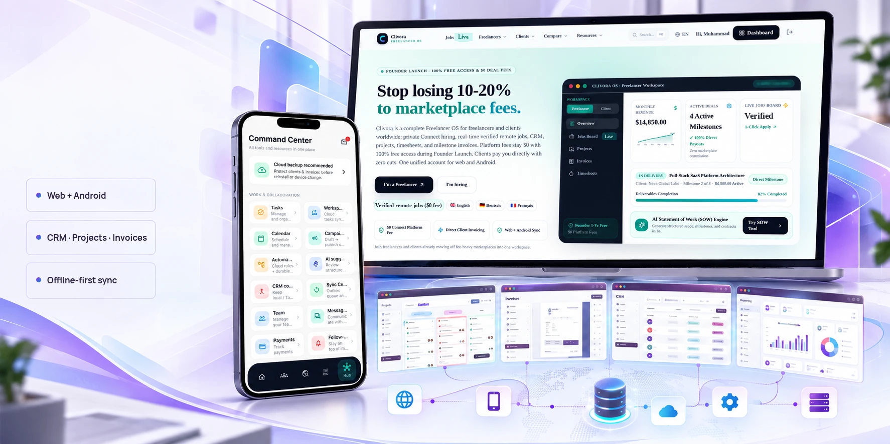
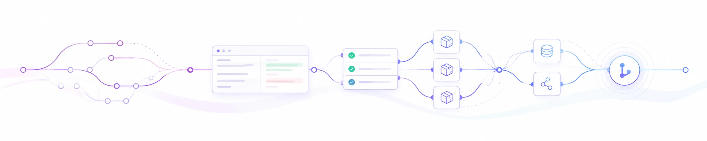

<!-- Profile README for Usman Ghias · https://usmanghias.co.uk -->

  
  
  
  

<picture>
  <source media="(prefers-color-scheme: dark)" srcset="assets/brand/proof-strip-dark.svg">
  
</picture>

# Usman Ghias

**Lead Distributed Systems Architect & Enterprise ERP Engineer**  
Founder & Principal Architect at [CODCrafters](https://codcrafters.org) · Remote Worldwide

I design enterprise ERP systems, transaction backends, and offline-first mobile products. Over the past 6 years, I have delivered 91+ Odoo builds and 185+ total projects across Europe, the Middle East, and North America, reducing query response times by over 60% on multi-million row PostgreSQL databases.

---

## What I architect

- **Enterprise ERP & Database Engines**: Odoo 15 to 19, Python ORM, PostgreSQL query profiling, PgBouncer pooling, OWL reactive components, and zero-bloat modular architecture.
- **Cryptographic Compliance**: ZATCA Phase 2 E-Invoicing engine for Saudi Arabia and GCC, implementing ECDSA secp256k1 signing, SHA-256 UBL 2.1 XML hashing, QR code TLV digests, and automated clearance API handshakes.
- **Distributed Product Engineering**: Offline-first mobile systems on Flutter (Riverpod, Hive, SQLite) syncing with Next.js web applications and REST APIs.
- **Lightweight DevOps**: Self-hosted developer infrastructure on Linux, Docker, Nginx, and cloud clusters.

---

## Selected enterprise systems

#### Automotive & parts distribution
- **Context**: European distributor managing multi-currency parts catalogues, workshop orders, dynamic pricing, and EU VAT rules across split processes.
- **Architecture**: Odoo 17/18 Enterprise with PostgreSQL and OWL. Designed 15+ custom modules for real-time carrier APIs and optimized ORM query paths.
- **Result**: Cut core report generation latency by 60%, delivering sub-second response times on heavy concurrent inventory lookups. [Automotive case study](https://www.codcrafters.org/industries/automotive)

#### Healthcare & hospital operations
- **Context**: Multi-department hospital running clinical records, billing, pharmacy stock, and insurance claims in disconnected tools.
- **Architecture**: Centralized Odoo HMS covering patient journeys, lab diagnostic workflows, pharmacy inventory, and automated billing.
- **Result**: Unified administrative and clinical operations into one database of record with role-based access control. [Healthcare case study](https://www.codcrafters.org/industries/healthcare)

#### ZATCA Phase 2 cryptographic e-invoicing
- **Context**: Saudi enterprise requiring automated, tamper-proof electronic invoice clearance under ZATCA Phase 2 mandate.
- **Architecture**: Native Python and Odoo cryptographic engine generating canonical XML UBL 2.1, ECDSA digital signatures, cryptographic invoice hashing, and TLV Base64 QR encoding.
- **Result**: 100% compliant real-time API clearance with ZATCA Fatoora portal without third-party recurring SaaS fees.

---

## Product engineering: CLIVORA

#### [CLIVORA](https://clivora.io): Offline-First Freelancer & Agency Workspace
Freelancers and agencies often juggle separate tools for CRM, tasks, timesheets, and invoicing. CLIVORA combines these into one synchronized workspace on Web and Android.
- **Role**: Founder and Principal Architect; designed full backend, database schemas, and mobile sync engine.
- **Architecture**: Flutter mobile client with offline-first local storage (Hive + SQLite) syncing with Next.js web console and REST endpoints.
- **Availability**: Live at [clivora.io](https://clivora.io) and published on [Google Play](https://play.google.com/store/apps/details?id=org.codcrafters.clivora).

---

## Experience & academic research

- **Founder & Principal Architect**, CODCrafters (2022 - present)  
  Directing enterprise ERP deliveries, performance audits, and custom software engineering for clients across 25+ countries.
- **Senior Odoo Spreadsheets & BI Specialist**, Plectar, Switzerland (2025 - present)  
  Multi-dimensional financial and operational modeling, OWL dashboard engineering, and legacy reporting migrations.
- **MS in Software Engineering**, Quantic School of Business and Technology, Washington D.C., USA  
  Graduating October 2026. Cumulative academic standing: **94.75%**, proctored comprehensive exam score: **92%**.
- **BS in Software Engineering (Distinction)**, PUCIT, Lahore  
  Appointed 3-time University Teaching Assistant for Data Science, Computer Networks, and Object-Oriented C++.
- **Research Preprint**: Zenodo DOI [10.5281/zenodo.22843765](https://doi.org/10.5281/zenodo.22843765)  
  Focus on low-latency microservice architecture and transaction routing in enterprise ERP systems.
- **Doctoral Research Focus**: Actively seeking prospective Ph.D. scholarships and doctoral supervisor alignment in Distributed Systems and High-Concurrency Database Engines for 2026/2027 intake.

---

## Open-source engineering

  
  

**Selected Pull Requests & Contributions:**
- [zifter/clickhouse-migrations #105](https://github.com/zifter/clickhouse-migrations/pull/105): Migrated PyPI release workflow to Trusted Publishing (OIDC).
- [progovoy/vmn #173](https://github.com/progovoy/vmn/pull/173): Added `--base` option to `vmn show` command.
- [cubrid-lab/sqlalchemy-cubrid #455](https://github.com/cubrid-lab/sqlalchemy-cubrid/pull/455): Fixed dialect reflection error mapping for syntax errors.
- [ehtishammubarik/websieve #47](https://github.com/ehtishammubarik/websieve/pull/47): Preserved code block indentation during page sanitization.

---

## GitHub activity

<picture>
  <source media="(prefers-color-scheme: dark)" srcset="https://raw.githubusercontent.com/UsmanGhias/UsmanGhias/output/github-stats-dark.svg">
  
</picture>

<picture>
  <source media="(prefers-color-scheme: dark)" srcset="https://raw.githubusercontent.com/UsmanGhias/UsmanGhias/output/github-contribution-grid-snake-dark.svg">
  
</picture>

---

## Technical stack

| Domain | Technologies |
| :--- | :--- |
| **ERP & Databases** | Odoo 15 to 19 · Python ORM · PostgreSQL · PgBouncer · Redis · SQLite · Hive |
| **Web & Mobile** | TypeScript · Next.js · React · Flutter · Riverpod · FastAPI · TailwindCSS |
| **Compliance & APIs** | ZATCA Phase 2 (ECDSA, UBL 2.1, QR TLV) · REST · GraphQL · XML-RPC / JSON-RPC |
| **DevOps & Cloud** | Linux · Docker · Nginx · Odoo.sh · AWS · GitHub Actions · Self-Hosted Clusters |

---

## Contact & inquiries

Building a new platform, modernizing an ERP instance, or discussing doctoral research?

[Official Portfolio](https://usmanghias.co.uk) · [Email Inquiry](mailto:iusmanghias@gmail.com) · [LinkedIn](https://www.linkedin.com/in/iusmanghias) · [CODCrafters](https://codcrafters.org) · [Upwork](https://www.upwork.com/freelancers/usmanghias) · [WhatsApp](https://wa.me/923126912440)
