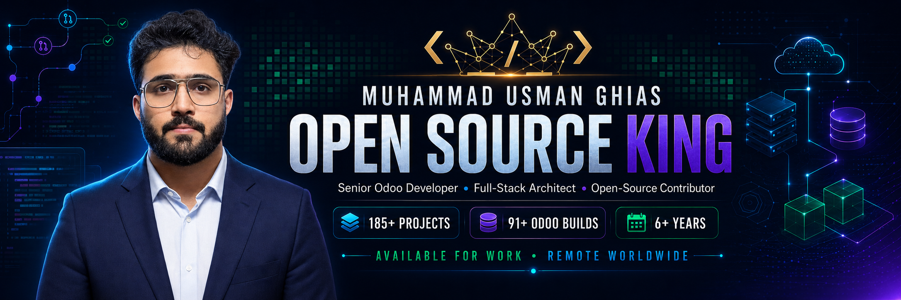

<!-- ====================================================================== -->
<!--                  MUHAMMAD USMAN GHIAS · ELITE DEVELOPER               -->
<!--        Crafted to be one of the most advanced GitHub profiles         -->
<!-- ====================================================================== -->

<a href="https://usman.codcrafters.org">
  
</a>
<td width="38%" valign="top" align="center">
  <p align="center">
    <a href="https://usman.codcrafters.org">
      
    </a>
  </p>
</td>

<div align="center">

<!-- ===================== DYNAMIC TYPING HEADLINE ===================== -->
[](https://usman.codcrafters.org)

<!-- ===================== PREMIUM STATUS BADGES ===================== -->
<p>
  
  
  
</p>

<!-- ===================== LIVE AVAILABILITY ===================== -->
<a href="mailto:iusmanghias@gmail.com?subject=Project%20Opportunity%20for%20Usman">
  
</a>

<p>
  <b>Open to full-time remote roles, freelance projects, long-term contracts, open-source collaboration, and enterprise consulting.</b>
  <br/>
  <sub>Odoo ERP · Full-Stack Web · Flutter Mobile · AI Automation · APIs · Cloud & DevOps</sub>
</p>

<!-- ===================== LIVE PROFILE METRICS ===================== -->
<p>
  <a href="https://github.com/UsmanGhias?tab=followers">
    
  </a>
  <a href="https://github.com/UsmanGhias?tab=repositories&sort=stargazers">
    
  </a>
  <a href="https://linkedin.com/in/m-usmanghias">
    
  </a>
  
</p>

<!-- ===================== VERIFIED CAREER SNAPSHOT ===================== -->
<p>
  
  
  
  
  
</p>

</div>

<!-- ===================== ANIMATED DIVIDER ===================== -->


<!-- ====================================================================== -->
<!--                              ABOUT ME                                  -->
<!-- ====================================================================== -->

<h2 align="center">
  
  &nbsp;About&nbsp;Me
  
</h2>

<table align="center" width="100%">
  <tr>
    <td width="62%" valign="top">

```yaml
Muhammad Usman Ghias:
  legal_name:  "Muhammad Usman Khan"
  role:        "Senior Odoo Developer, Full-Stack Engineer & System Architect"
  founder_of:  "CODCrafters"
  experience:  "6+ years of production software engineering"
  delivered:   "185+ production projects worldwide"
  odoo_builds: "91+ implementations, modules and integrations"
  location:    "Pakistan  ·  Available Worldwide  🌍"
  focus:       ["Odoo ERP", "MERN & Next.js", "Flutter", "AI Automation", "Cloud & DevOps"]
  superpower:  "Turning complex business problems into clean, scalable software"
  philosophy:  "Premium code. Pixel-perfect UX. Measurable impact."
  open_source: "Contributor, maintainer and knowledge sharer"
  availability: "Immediate · Remote · Worldwide"
  open_to:     "Full-time · Freelance · Long-term contracts · Enterprise consulting"
```

  <ul>
    <li>🏗️ <b>Odoo ERP Master</b> — custom modules, OWL, QWeb, XML-RPC & deep system integration.</li>
    <li>⚛️ <b>MERN Specialist</b> — production-grade React / Node / Express / MongoDB platforms.</li>
    <li>🚀 <b>Founder of CODCrafters</b> — building premium software for global clients.</li>
    <li>🏥 <b>Domain expert</b> — Hospital Management, ERP, E-commerce & automation.</li>
    <li>🌱 <b>Open-source contributor</b> — publishing reusable Odoo modules, developer resources and production-ready reference projects.</li>
    <li>🤝 <b>Team-ready engineer</b> — experienced with async collaboration, code reviews, mentoring and global time zones.</li>
    <li>💬 Ask me about <b>Odoo, MERN, APIs, microservices & cloud-native architecture</b>.</li>
  </ul>
  </tr>
</table>

<!-- ===================== QUICK CONNECT ROW ===================== -->
<div align="center">
  <a href="https://usman.codcrafters.org"></a>
  <a href="https://linkedin.com/in/m-usmanghias"></a>
  <a href="https://www.upwork.com/freelancers/usmanghias"></a>
  <a href="https://www.youtube.com/@codcrafters"></a>
  <a href="mailto:iusmanghias@gmail.com"></a>
  <a href="https://wa.me/923126912440"></a>
</div>

<!-- ===================== DIVIDER ===================== -->


<!-- ====================================================================== -->
<!--                            TECH ARSENAL                                -->
<!-- ====================================================================== -->

<h2 align="center">
  
  &nbsp;Elite&nbsp;Tech&nbsp;Arsenal
  
</h2>

<div align="center">

**🏗️ ERP & Frameworks**


**💻 Languages**

[](https://skillicons.dev)

**🎨 Frontend & UI**

[](https://skillicons.dev)

**⚙️ Backend & APIs**

[](https://skillicons.dev)

**🗄️ Databases**

[](https://skillicons.dev)

**☁️ Cloud, DevOps & Tools**

[](https://skillicons.dev)

**📱 Mobile & E-commerce**

[](https://skillicons.dev)


**🤖 AI, Automation & Integrations**


</div>

<!-- ===================== DIVIDER ===================== -->


<!-- ====================================================================== -->
<!--                         SERVICES / WHAT I DO                           -->
<!-- ====================================================================== -->

<h2 align="center">🚀 What I Build For Clients</h2>

<table align="center">
  <tr>
    <td align="center" width="25%">
      <br/>
      <b>Odoo ERP</b><br/>
      <sub>Custom modules,<br/>integration & automation</sub>
    </td>
    <td align="center" width="25%">
      <br/>
      <b>Full-Stack Web</b><br/>
      <sub>MERN apps, REST &<br/>GraphQL, microservices</sub>
    </td>
    <td align="center" width="25%">
      <br/>
      <b>Mobile Apps</b><br/>
      <sub>React Native &<br/>Flutter cross-platform</sub>
    </td>
    <td align="center" width="25%">
      <br/>
      <b>Cloud & DevOps</b><br/>
      <sub>Docker, K8s, CI/CD &<br/>cloud-native deploys</sub>
    </td>
  </tr>
</table>

<br/>

<table align="center" width="100%">
  <tr>
    <td width="50%" valign="top">
      <h3>🏢 For Businesses</h3>
      <ul>
        <li>Odoo implementation, migration and rescue work</li>
        <li>Custom ERP modules and automated workflows</li>
        <li>Production web and mobile product development</li>
        <li>API integrations and legacy system modernization</li>
        <li>Cloud deployment, performance and reliability</li>
      </ul>
    </td>
    <td width="50%" valign="top">
      <h3>👥 For Engineering Teams</h3>
      <ul>
        <li>Architecture and technical discovery</li>
        <li>Feature ownership from specification to production</li>
        <li>Code review, debugging and performance optimization</li>
        <li>Developer mentoring and technical documentation</li>
        <li>Open-source collaboration and maintainership</li>
      </ul>
    </td>
  </tr>
</table>

<!-- ====================================================================== -->
<!--                          FEATURED PROJECTS                             -->
<!-- ====================================================================== -->

<h2 align="center">🏆 Featured Work</h2>

<div align="center">

| Project | Description | Stack |
| :------ | :---------- | :---- |
| 🏥 **Odoo Hospital Management System** | End-to-end HMS — patients, billing, insurance, lab, pharmacy & dashboards | `Odoo` · `Python` · `PostgreSQL` |
| 🛒 **Enterprise E-commerce Suites** | Custom storefronts, payments & inventory automation | `Shopify` · `WooCommerce` · `MERN` |
| 🔗 **API & System Integrations** | Secure REST / GraphQL services & third-party integrations | `Node` · `Django` · `XML-RPC` |
| 📊 **Business Automation Modules** | Process automation that saves teams hundreds of hours | `Odoo` · `Python` · `OWL` |
| 💼 **CLIVORA Freelancer Workspace** | A connected operating system for freelancers, agencies and clients across web and Android | `Next.js` · `Flutter` · `Supabase` |
| 📱 **Production Flutter Applications** | Offline-ready mobile products for productivity, fitness and Islamic lifestyle use cases | `Flutter` · `Riverpod` · `Firebase` |

<a href="https://usman.codcrafters.org">
  
</a>

</div>

<!-- ====================================================================== -->
<!--                        OPEN SOURCE CONTRIBUTOR                         -->
<!-- ====================================================================== -->

<h2 align="center">🌍 Open Source & Community</h2>

<div align="center">

> I believe useful engineering knowledge should be shared. I publish reusable code, practical examples and production lessons that help other developers build faster and avoid common mistakes.

</div>

<table align="center" width="100%">
  <tr>
    <td width="33%" align="center" valign="top">
      <h3>🧩 Build in Public</h3>
      <p>Reusable Odoo modules, integrations, full-stack products and practical reference implementations.</p>
    </td>
    <td width="33%" align="center" valign="top">
      <h3>🤝 Collaborate</h3>
      <p>Open to meaningful pull requests, issue discussions, technical reviews and cross-project collaboration.</p>
    </td>
    <td width="33%" align="center" valign="top">
      <h3>📚 Share Knowledge</h3>
      <p>Documentation, examples, developer guidance and lessons learned from real production systems.</p>
    </td>
  </tr>
</table>

<div align="center">
  <a href="https://github.com/UsmanGhias?tab=repositories">
    
  </a>
  <a href="https://github.com/UsmanGhias?tab=stars">
    
  </a>
</div>

### 💡 I Welcome Contributions Around

- Odoo Community modules, OWL components, QWeb reports and ERP integrations
- Python, JavaScript, TypeScript, React, Next.js, Node.js and Flutter
- Developer tooling, documentation, test coverage and accessibility
- AI-powered business automation and open-source productivity products
- Issues with clear reproduction steps and pull requests with focused changes

<!-- ====================================================================== -->
<!--                            CURRENT FOCUS                               -->
<!-- ====================================================================== -->

<h2 align="center">🎯 What I Am Working On</h2>

<div align="center">

| Focus | What I Am Building |
| :---- | :----------------- |
| 🧠 **Odoo + AI** | Practical AI-assisted ERP workflows, reporting and business automation |
| 💼 **CLIVORA** | A freelancer and agency workspace connecting CRM, projects, invoices, clients and marketplace workflows |
| 📱 **Flutter Products** | Reliable, offline-capable Android applications with clean architecture |
| 🌐 **Open Source** | More reusable modules, reference projects, documentation and contributor-friendly repositories |
| 🤝 **New Opportunities** | Senior Odoo, full-stack, mobile, AI automation and technical leadership engagements |

</div>

<!-- ===================== DIVIDER ===================== -->


<!-- ====================================================================== -->
<!--                         GITHUB ANALYTICS                               -->
<!-- ====================================================================== -->

<h2 align="center">📊 GitHub Analytics</h2>
<div align="center">
  
</div>

<!-- ====================================================================== -->
<!--                           SNAKE ANIMATION                              -->
<!-- ====================================================================== -->

<h2 align="center">🐍 Contribution Snake</h2>

<div align="center">
  <picture>
    <source media="(prefers-color-scheme: dark)" srcset="https://raw.githubusercontent.com/UsmanGhias/UsmanGhias/output/github-contribution-grid-snake-dark.svg">
    <source media="(prefers-color-scheme: light)" srcset="https://raw.githubusercontent.com/UsmanGhias/UsmanGhias/output/github-contribution-grid-snake.svg">
    
  </picture>
</div>

<!-- ====================================================================== -->
<!--                         ENGINEERING VALUES                             -->
<!-- ====================================================================== -->

<h2 align="center">🧭 How I Engineer</h2>

<div align="center">

`Understand the business` → `Design for change` → `Build cleanly` → `Test real flows` → `Ship` → `Support`

</div>

<table align="center" width="100%">
  <tr>
    <td width="25%" align="center"><b>✅ Production First</b><br/><sub>Reliable software, not portfolio-only demos</sub></td>
    <td width="25%" align="center"><b>🧪 Quality Driven</b><br/><sub>Testing, review and measurable acceptance criteria</sub></td>
    <td width="25%" align="center"><b>📖 Maintainable</b><br/><sub>Clear code, documentation and sensible architecture</sub></td>
    <td width="25%" align="center"><b>💬 Transparent</b><br/><sub>Direct communication and visible progress</sub></td>
  </tr>
</table>

<!-- ====================================================================== -->
<!--                              QUOTE                                     -->
<!-- ====================================================================== -->

<div align="center">
  
</div>

<!-- ====================================================================== -->
<!--                          LET'S CONNECT                                 -->
<!-- ====================================================================== -->

<h2 align="center">🤝 Let's Build Something Extraordinary</h2>

<div align="center">
  <p>
    Have an Odoo challenge, a product idea, an existing codebase that needs help, or an open-source project worth improving?
    <br/>
    <b>Send me a short message with your goal, current stack and expected timeline.</b>
  </p>
  <a href="mailto:iusmanghias@gmail.com?subject=Work%20Opportunity%20for%20Usman">
    
  </a>
</div>

<br/>

<div align="center">
  <a href="https://usman.codcrafters.org"></a>
  <a href="https://github.com/UsmanGhias"></a>
  <a href="https://linkedin.com/in/m-usmanghias"></a>
  <a href="https://www.upwork.com/freelancers/usmanghias"></a>
  <a href="https://www.youtube.com/@codcrafters"></a>
  <a href="mailto:iusmanghias@gmail.com"></a>
  <a href="https://wa.me/923126912440"></a>
</div>

<br/>

<div align="center">
  
  
  
</div>

<br/>

<div align="center">
  
  
  
</div>

<!-- ====================================================================== -->
<!--                              FOOTER                                    -->
<!-- ====================================================================== -->


